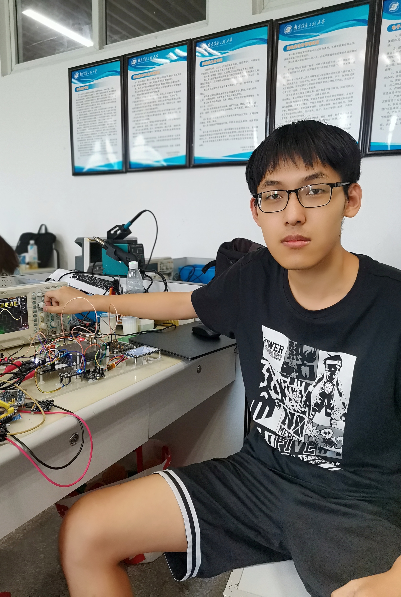

# I am an electronic engineer from China🌏
🧑‍🔧Senior majoring in electronic information engineering 
🏫Currently studying as a graduate student in electronic information technology 
🚀Main technical direction: MCU/PCB/Embedded software and hardware development<
br>

## My open source homepages🛠️
Bilibili video personal homepage：https://space.bilibili.com/346179450?spm_id_from=333.1007.0.0 
Oshwhub PCB Open-source hardware personal homepage: https://oshwhub.com/expert 
CSDN personal technology blog: https://blog.csdn.net/physicsexpert?spm=1000.2115.3001.5343 
## I will continue to update open source projects and look forward to your likes and attention❤️⭐🏆

|  |  |
| ------------- | ------------- |
